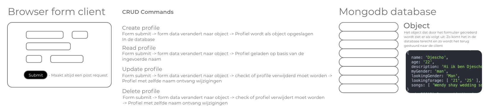

# Music Match | ProjectTech

In dit project ga ik een webapp bouwen. Omdat ik verder geen codeer ervaring heb zal dit een hele opgave worden, maar dit is stap voor stap in de wiki te volgen. De matchingapp die ik ga bouwen heet MusicMatch, en wordt een matchingapp op basis van muziek smaak.

## Wat kan je met Music Match?

In deze app is het mogelijk een profiel aan te maken in de app. Deze wordt opgeslagen in de database en is vanaf dat moment toegankelijk en bewerkbaar. Klaar met Music Match? Je account verwijdren is zo simpel als een checkbox aanklikken.

## Database model



## Achtergrond

Dit project doe voor mijn tech specialisatie voor mijn opleiding CMD (Communicatie en multimedia design). Mijn doel is om een goed begrip van nodeJS, JavaScript en webdevelopment in het algemeen te krijgen.

### Upcomming features

Spotify API support | Hiermee wordt het mogelijk jouw gekozen muziek automatisch in te laden zodra je inlogt.

# Installatie

Om MusicMatch te installeren zijn er een aantal handelingen nodig. Geen zorgen ik loop er stap voor stap doorheen.

Om te beginnen moeten we de vereiste bestanden vanuit github op jouw computer krijgen. Zorg dat je binnen de terminal in een map zit waar je de app wilt installeren. Om de GitHub repository te downloaden voeren we het volgende commando in in de terminal:

```tsx
git clone https://github.com/Djescho/ProjectTech
```

Om de installatie te voltooien moeten de node.js modules die bij dit project horen worden gedownload. Deze staan in het package.json bestand en zullen met het volgende commando automatisch geïnstalleerd worden:

```tsx
npm install
```

Nu ben je klaar voor de start!
_Nog steeds problemen? Maak een Issue aan!_

## Het programma starten

Het zal misschien opvallen dat er een wat vreemder bestandje is meegekomen met de installatie. het .env.example file bevat de tekstuele waarde (en dus niet de echte waarde) van het originele bestand. Zo kan je ook de applicatie aan jouw kant werkende krijgen.

### standaard

Om het opstarten van zowel de webserver als de applicatie zo gemakkelijk mogelijk te maken hoeft alleen het volgende commando ingevoerd te worden:

```tsx
npm start
```

### devs

Ook voor developers heb ik het zo makkelijk mogelijk gemaakt. Met de dev set-up krijg je toegang tot nodemon om de server gemakkelijk te herstarten. Hiervoor run je het volgende command in de terminal:

```tsx
npm run dev
```

## Contributie

Djescho Mananga

## Licence

MIT
